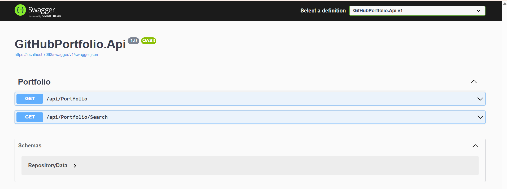

# Practicode 5 — GitHub Portfolio Backend

A production-oriented ASP.NET Core backend designed with Clean Architecture principles for maintainability, scalability, and testability.

## Engineering Objectives

- Enforce strict **Separation of Concerns** across application layers.
- Keep business rules independent from infrastructure and delivery mechanisms.
- Enable safe evolution through clear boundaries, dependency inversion, and composable services.

## Clean Architecture

The solution follows a layered architecture with explicit responsibilities:

### 1) API Layer (Presentation)
**Responsibility:** HTTP transport, routing, validation, request/response contracts, and API documentation.

- Hosts controllers and endpoint definitions.
- Delegates business work to application/service abstractions.
- Does not contain persistence logic or domain rules.

### 2) Core Layer (Domain + Application Contracts)
**Responsibility:** Business rules, entities, value objects, and interfaces.

- Contains domain-centric models and use-case abstractions.
- Defines contracts such as repository interfaces.
- Must remain framework-agnostic.

### 3) Data Layer (Infrastructure + Persistence)
**Responsibility:** Database access and external infrastructure integration.

- Implements repositories defined in Core.
- Uses **Entity Framework Core** for ORM, migrations, and SQL Server integration.
- Encapsulates data access concerns and persistence details.

### 4) Service Layer (Application Services)
**Responsibility:** Orchestrates use-cases and cross-cutting application workflows.

- Coordinates domain operations using Core abstractions.
- Uses repositories through interfaces (not concrete DB classes).
- Serves as the execution boundary between API requests and data operations.

## Layer Interaction Model

Request flow is intentionally directional:

1. **API** receives HTTP input and calls service interfaces.
2. **Service** executes use-case logic and requests data via repository contracts.
3. **Data** resolves repository implementations and persists/queries through EF Core.
4. The result returns from **Data → Service → API** as a response DTO.

This preserves Separation of Concerns, reduces coupling, and supports independent testing per layer.

## Architectural Practices

### Dependency Injection
- Service and repository abstractions are registered in the container.
- Concrete implementations are resolved at runtime.
- Promotes loose coupling and testability.

### Repository Pattern
- Repository interfaces are defined in Core.
- Implementations live in Data.
- Business logic remains independent from storage technology.

### Entity Framework Core
- Provides SQL Server data access, LINQ querying, migrations, and change tracking.
- Acts as the persistence engine behind repository implementations.

## API Documentation

Interactive API documentation is exposed through Swagger/OpenAPI.

  

The image showcases the RESTful API endpoints, specifically the Portfolio management services, integrated with Swagger for automated documentation and testing.

## Tech Stack

| Category | Technology |
|---|---|
| Runtime / Framework | .NET 8 (ASP.NET Core Web API) |
| Data Platform | SQL Server |
| ORM | Entity Framework Core |
| API Documentation | Swagger / OpenAPI (Swashbuckle) |
| Dependency Injection | Built-in ASP.NET Core DI container |

## Solution Structure

- `GitHubPortfolio.Api` — API/presentation layer.
- `GitHubPortfolio.Services` — service/application orchestration layer.
- `GitHubPortfolio.Core` — domain models and contracts (recommended structure).
- `GitHubPortfolio.Data` — persistence and repository implementations (recommended structure).

## Getting Started

1. Restore packages.
2. Build the solution.
3. Run the API project.
4. Open the Swagger endpoint and verify available routes.

---

This project is structured for professional backend delivery with clear boundaries, explicit contracts, and maintainable growth paths.
